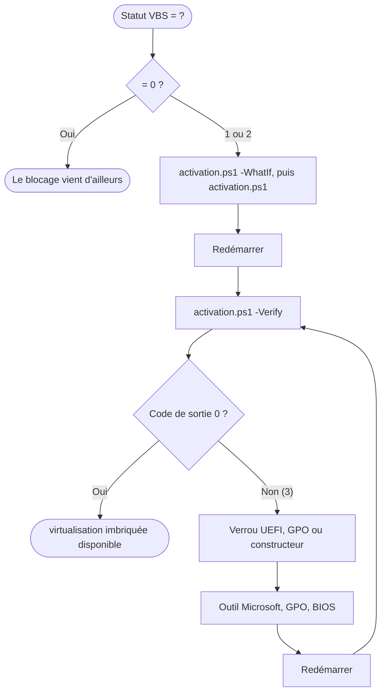

<div align="center">

# Nested Virtualization Enabling

**Activez la virtualisation imbriquée sur Windows, proprement et de façon réversible.**

Pour VMware Workstation, VirtualBox, EVE-NG, GNS3 et tout hyperviseur exécuté dans une VM.

[](#prérequis) [](#prérequis) [](#restauration) [](#utilisation)

[Démarrage rapide](#démarrage-rapide) · [Choisir l'approche](#choisir-la-bonne-approche) · [Utilisation](#utilisation) · [Restauration](#restauration) · [Dépannage](#si-vbs-reste-actif)

</div>

---

## Sommaire

- [Nested Virtualization Enabling](#nested-virtualization-enabling)
  - [Sommaire](#sommaire)
  - [Démarrage rapide](#démarrage-rapide)
  - [Pourquoi ce projet](#pourquoi-ce-projet)
  - [Choisir la bonne approche](#choisir-la-bonne-approche)
  - [Impact sur la sécurité](#impact-sur-la-sécurité)
  - [Prérequis](#prérequis)
  - [Utilisation](#utilisation)
    - [Flux de travail](#flux-de-travail)
    - [Paramètres de `activation.ps1`](#paramètres-de-activationps1)
    - [Codes de sortie](#codes-de-sortie)
    - [Fichiers produits](#fichiers-produits)
  - [Détail des actions](#détail-des-actions)
    - [Fonctionnalités Windows](#fonctionnalités-windows)
    - [Registre](#registre)
    - [Démarrage (BCD)](#démarrage-bcd)
  - [Restauration](#restauration)
  - [Si VBS reste actif](#si-vbs-reste-actif)
    - [Outil Microsoft de préparation](#outil-microsoft-de-préparation)
    - [Constructeurs courants](#constructeurs-courants)
    - [Domaine et GPO](#domaine-et-gpo)
  - [Diagnostic](#diagnostic)
  - [Procédure manuelle](#procédure-manuelle)
  - [Pièges fréquents](#pièges-fréquents)
  - [Limites](#limites)
  - [Structure du dépôt](#structure-du-dépôt)
  - [Sécurité et responsabilité](#sécurité-et-responsabilité)
  - [Auteur](#auteur)

---

## Démarrage rapide

Ouvrez **PowerShell en tant qu'administrateur** dans le dossier du projet :

```powershell
# 1. Autoriser les scripts pour cette session uniquement, et lever le blocage d'un téléchargement
Set-ExecutionPolicy -Scope Process Bypass
Unblock-File .\*.ps1

# 2. Simuler : affiche ce qui serait modifié, sans rien changer
.\activation.ps1 -WhatIf

# 3. Appliquer (sauvegarde de l'état initial, confirmation, redémarrage proposé)
.\activation.ps1

# 4. Après le redémarrage : valider le résultat
.\activation.ps1 -Verify
```

Pour revenir à l'état d'origine :

```powershell
.\rollback.ps1 -WhatIf     # aperçu de la restauration
.\rollback.ps1             # restauration
.\rollback.ps1 -Verify     # après redémarrage : contrôle de conformité
```

> [!TIP]
> Chaque commande accepte `-WhatIf`. Commencez toujours par une simulation.

---

## Pourquoi ce projet

Lorsque Hyper-V et VBS sont actifs, Windows utilise son propre hyperviseur pour renforcer la protection du système (Credential Guard, Memory Integrity). Un second hyperviseur (VMware, VirtualBox, KVM…) n'obtient alors plus l'accès direct à VT-x ou AMD-V, et la virtualisation imbriquée devient impossible.

**Symptômes courants**

- VMware Workstation refuse d'installer ou de démarrer une VM imbriquée.
- VirtualBox signale que VT-x ou AMD-V n'est pas disponible.
- EVE-NG ou GNS3 ne démarrent pas, faute de pouvoir créer un hyperviseur imbriqué.
- `VirtualizationBasedSecurityStatus` reste à `2` malgré la désactivation des fonctionnalités Windows et la modification du registre.

**Messages d'erreur typiques**

| Outil | Message | Cause probable |
|---|---|---|
| VMware Workstation | `Intel VT-x/EPT is not supported on this platform` | Hyperviseur Windows actif (Hyper-V, VBS) alors que la VM demande la virtualisation imbriquée |
| VMware Workstation | `VMware Workstation and Device/Credential Guard are not compatible. VMware Workstation can be run after disabling Device/Credential Guard.` | Device Guard ou Credential Guard (VBS) actif |
| VMware Workstation | `VMware Workstation does not support nested virtualization on this host. Module 'HV' power on failed.` | Mode coexistence Hyper-V : virtualisation imbriquée non prise en charge |
| VirtualBox | `VT-x is not available (VERR_VMX_NO_VMX)` | Hyperviseur Windows actif, ou VT-x désactivé dans le BIOS / UEFI |
| EVE-NG, GNS3 VM (Linux invité) | `kvm-ok` : `KVM acceleration can NOT be used` | L'hôte n'expose pas VT-x / AMD-V à la VM imbriquée |

Dans une VM Linux (EVE-NG, GNS3 VM), le même symptôme se vérifie ainsi :

```bash
grep -Ec 'vmx|svm' /proc/cpuinfo    # 0 = virtualisation matérielle non exposée à la VM
```

> [!NOTE]
> Le message `This host supports Intel VT-x, but Intel VT-x is disabled` signale une virtualisation désactivée dans le BIOS / UEFI. Ce cas se règle dans le firmware, pas avec ces scripts.

**Les responsables habituels**

| Composant | Rôle | Effet sur la virtualisation imbriquée |
|---|---|---|
| Hyper-V / plateforme d'hyperviseur | Hyperviseur du noyau Windows | Monopolise VT-x / AMD-V |
| VBS | Isole les zones sensibles via l'hyperviseur | Force le lancement de l'hyperviseur |
| HVCI (Memory Integrity) | Contrôle d'intégrité du code noyau | Dépend de VBS |
| Credential Guard | Isole les secrets d'authentification | Dépend de VBS |

Depuis VMware Workstation 15.5.5, le mode de coexistence *Host VBS Mode* permet à VMware de tourner par-dessus Hyper-V via la Windows Hypervisor Platform. Ce mode **ne prend pas en charge la virtualisation imbriquée** (limitation documentée par VMware) : la case « Virtualiser Intel VT-x/EPT ou AMD-V/RVI » fait échouer l'environnement.

Ce dépôt fournit un outil de remédiation pour les **postes de laboratoire, de développement et de test** où la virtualisation imbriquée est une exigence fonctionnelle.

---

## Choisir la bonne approche

Désactiver VBS n'est pas toujours nécessaire. Avant de modifier la sécurité de l'hôte, vérifiez qu'aucune alternative ne convient.

| Votre besoin | Approche |
|---|---|
| Exécuter VMware / VirtualBox / EVE-NG avec une VM imbriquée sur un hôte Windows | **Ce projet** |
| Garder VBS actif et faire de l'imbriqué | Hyper-V natif : `Set-VMProcessor -VMName <vm> -ExposeVirtualizationExtensions $true` (support AMD selon la génération et la version de Windows) |
| Alterner entre « sécurité maximale » et « laboratoire » sans modifier le système | Entrée de démarrage dédiée (voir ci-dessous), à tester sur votre machine |
| Aucune VM imbriquée nécessaire | Laisser VBS actif ; le mode coexistence VMware suffit |

<details>
<summary><b>Alternative : entrée de démarrage dédiée</b></summary>

<br>

Une copie de l'entrée de démarrage avec l'hyperviseur désactivé permet de choisir, à chaque démarrage, entre l'environnement standard et l'environnement de laboratoire, sans toucher au registre.

```powershell
# Crée la copie et affiche son identifiant (GUID)
bcdedit /copy '{current}' /d "Windows - Laboratoire (sans hyperviseur)"

# Désactive l'hyperviseur uniquement pour cette entrée (remplacez le GUID retourné)
bcdedit /set '{GUID-RETOURNÉ}' hypervisorlaunchtype off
```

</details>

> [!NOTE]
> Si VBS ou HVCI sont imposés par ailleurs (verrou UEFI, stratégie de groupe), cette entrée seule peut ne pas suffire. Contrôlez le résultat avec `Get-CimInstance -ClassName Win32_DeviceGuard -Namespace root\Microsoft\Windows\DeviceGuard`.

---

## Impact sur la sécurité

Désactiver VBS, Credential Guard et HVCI réduit des protections conçues pour isoler la mémoire sensible, protéger les identifiants et bloquer l'exécution de code non fiable au niveau du noyau.

| Contexte | Recommandation |
|---|---|
| Poste personnel / machine de laboratoire | Compromis raisonnable si la virtualisation imbriquée est nécessaire |
| Poste d'entreprise ou machine gérée (domaine, MDM) | **Ne pas appliquer sans validation IT / sécurité** |

> [!WARNING]
> Ne stockez pas de secrets sensibles sur une machine dont la protection des identifiants est désactivée, et restaurez l'état d'origine dès que le besoin disparaît.

---

## Prérequis

- Windows 10 ou 11, avec un compte **administrateur** et **PowerShell 5.1 ou supérieur**.
- Virtualisation matérielle (Intel VT-x / AMD-V) activée dans le BIOS / UEFI.
- Un besoin réel de virtualisation imbriquée, et l'acceptation de la réduction de sécurité décrite plus haut.
- Machine jointe à un domaine : s'assurer qu'aucune GPO ne réactive VBS.
- **BitLocker** : si le disque système est protégé, sauvegardez votre clé de récupération avant de commencer.

  ```powershell
  manage-bde -protectors -get C:
  ```

**Effets de bord à connaître**

- Désactiver `VirtualMachinePlatform` arrête **WSL2 et Docker Desktop** (backend WSL2).
- Désactiver `Containers-DisposableClientVM` supprime **Windows Sandbox**.

---

## Utilisation

### Flux de travail



### Paramètres de `activation.ps1`

| Paramètre | Effet |
|---|---|
| `-WhatIf` | Simule sans rien modifier |
| `-Verify` | Ne modifie rien ; contrôle l'état après redémarrage |
| `-Force` | Ne demande pas de confirmation (automatisation) |
| `-SkipReboot` | Ne propose pas de redémarrage |
| `-NoTranscript` | Ne crée pas de fichier journal |
| `-IncludeContainers` | Désactive aussi la fonctionnalité Windows `Containers` |
| `-DisableServices` | Arrête et désactive aussi `vmms`, `vmcompute`, `HvHost`, `lxssmanager` |

### Codes de sortie

| Code | Signification |
|---|---|
| `0` | Succès |
| `1` | Au moins une étape a échoué |
| `2` | Opération annulée par l'utilisateur |
| `3` | `-Verify` : la virtualisation imbriquée n'est pas encore possible (ou écarts avec l'état d'origine pour `rollback.ps1`) |

### Fichiers produits

Tout est écrit dans `%ProgramData%\nested-virt-enabling\` (indépendant de la redirection OneDrive du Bureau).

| Fichier | Contenu |
|---|---|
| `original-state.json` | État d'origine de la machine, écrit **une seule fois** et jamais écrasé |
| `snapshot-<date>.json` | Instantané de chaque exécution |
| `nested-virt-enabling.log` | Journal d'`activation.ps1` |
| `nested-virt-enabling-rollback.log` | Journal de `rollback.ps1` |

---

## Détail des actions

`activation.ps1` enchaîne les étapes suivantes. Chacune est idempotente : relancer le script ne modifie que ce qui reste à faire.

| Étape | Action |
|---|---|
| 1 | Analyse du contexte : Windows, domaine, virtualisation BIOS/UEFI, BitLocker, état VBS initial |
| 2 | Confirmation explicite (sauf `-Force`) |
| 3 | Sauvegarde de l'état initial en JSON |
| 4 | Désactivation des fonctionnalités Windows |
| 5 | Modification du registre |
| 6 | `bcdedit` : `hypervisorlaunchtype off` |
| 7 | Services Hyper-V / WSL (uniquement avec `-DisableServices`) |
| 8 | Bilan |
| 9 | Proposition de redémarrage avec délai de 60 s (annulable : `shutdown /a`) |

### Fonctionnalités Windows

| Fonctionnalité | Rôle |
|---|---|
| `Microsoft-Hyper-V-All` | Ensemble des composants Hyper-V |
| `HypervisorPlatform` | Windows Hypervisor Platform (utilisée par les hyperviseurs tiers en mode coexistence) |
| `VirtualMachinePlatform` | Plateforme de machines virtuelles (WSL2, Docker Desktop) |
| `Containers-DisposableClientVM` | Windows Sandbox |
| `Containers` | Support des conteneurs Windows (**uniquement avec `-IncludeContainers`**) |

### Registre

| Clé | Valeur | Cible | Mode |
|---|---|---|---|
| `HKLM\SYSTEM\CurrentControlSet\Control\DeviceGuard` | `EnableVirtualizationBasedSecurity` | `0` | Toujours |
| `HKLM\SYSTEM\CurrentControlSet\Control\DeviceGuard` | `RequirePlatformSecurityFeatures` | `0` | Toujours |
| `...\DeviceGuard\Scenarios\HypervisorEnforcedCodeIntegrity` | `Enabled` | `0` | Toujours |
| `...\DeviceGuard\Scenarios\CredentialGuard` | `Enabled` | `0` | Si la valeur existe |
| `HKLM\SYSTEM\CurrentControlSet\Control\Lsa` | `LsaCfgFlags` | `0` | Si la valeur existe |
| `HKLM\SOFTWARE\Policies\Microsoft\Windows\DeviceGuard` | `EnableVirtualizationBasedSecurity`, `RequirePlatformSecurityFeatures`, `LsaCfgFlags` | `0` | Si la valeur existe |

> [!NOTE]
> Le mode « si la valeur existe » évite de créer de fausses stratégies dans `Policies`, qui feraient apparaître le réglage comme géré par une organisation dans Windows Sécurité.

### Démarrage (BCD)

`bcdedit /set hypervisorlaunchtype off` empêche l'hyperviseur Windows de se relancer au démarrage, même si les composants sont désactivés. Le script contrôle le code de retour de `bcdedit` et relit la valeur pour confirmer.

---

## Restauration

`rollback.ps1` **restaure l'état d'origine** enregistré dans `original-state.json` et n'applique que les différences constatées, sans imposer de valeurs par défaut.

| Élément | Comportement |
|---|---|
| Registre | Une valeur qui existait reprend sa valeur d'origine. Une valeur absente à l'origine est supprimée (et sa clé, si elle est devenue vide) |
| Démarrage | `hypervisorlaunchtype` revient à `auto` ou `off`, ou est supprimé s'il n'était pas défini |
| Fonctionnalités | Réactivées uniquement si elles l'étaient à l'origine. Une fonctionnalité activée depuis (WSL2, Docker…) n'est **jamais** désactivée |
| Services | Seul le type de démarrage est restauré ; ils démarrent au redémarrage suivant |

Le plan de restauration est affiché avant toute modification. Une confirmation est demandée (sauf `-Force`).

**Après le redémarrage**, `.\rollback.ps1 -Verify` compare la machine à l'état d'origine. Si tout est conforme, `original-state.json` est archivé en `original-state.restored-<date>.json`, afin que la prochaine activation enregistre un nouvel état de référence.

> [!IMPORTANT]
> Un état d'origine provenant d'une autre machine est refusé sauf avec `-Force`. Sans `original-state.json`, aucune restauration fiable n'est possible : le script s'arrête plutôt que d'appliquer des valeurs par défaut arbitraires.

---

## Si VBS reste actif

Si `.\activation.ps1 -Verify` retourne le code `3`, un élément supplémentaire réimpose VBS :

- verrou UEFI matériel ;
- sécurité OEM du constructeur ;
- stratégie de groupe Active Directory (réactivation à chaque `gpupdate`) ;
- pilote tiers incompatible, ou renforcement propre à une plateforme après une mise à jour Windows.

### Outil Microsoft de préparation

Le dossier [`dgreadiness_v3.6`](dgreadiness_v3.6) contient le *Device Guard and Credential Guard Hardware Readiness Tool*, qui pilote la désactivation d'un verrou UEFI.

| Fichier | Rôle |
|---|---|
| [`DG_Readiness_Tool_v3.6.ps1`](dgreadiness_v3.6/DG_Readiness_Tool_v3.6.ps1) | Script principal |
| [`ReadMe.txt`](dgreadiness_v3.6/ReadMe.txt) | Documentation fournie avec l'outil |
| `DefaultWindows_Audit.xml` / `_sipolicy.p7b` | Stratégie Code Integrity en mode audit |
| `DefaultWindows_Enforced.xml` / `_sipolicy.p7b` | Stratégie Code Integrity en mode appliqué |

```powershell
.\dgreadiness_v3.6\DG_Readiness_Tool_v3.6.ps1 -Capable
.\dgreadiness_v3.6\DG_Readiness_Tool_v3.6.ps1 -Disable
.\dgreadiness_v3.6\DG_Readiness_Tool_v3.6.ps1 -Ready
```

Si `Config-CI` reste en mode `Enforced` : `.\dgreadiness_v3.6\DG_Readiness_Tool_v3.6.ps1 -Clear`.

> [!CAUTION]
> - `-Capable` active **Driver Verifier** : un pilote incompatible peut provoquer un écran bleu, et un redémarrage supplémentaire est parfois nécessaire.
> - `-Enable` applique une stratégie Code Integrity par défaut et pose un **verrou UEFI** difficile à annuler. Ne l'utilisez pas comme « rollback » par défaut.
> - Les changements UEFI faits avec cet outil ne sont **pas** restaurés par `rollback.ps1`.

Cet outil est un composant Microsoft historique et reste soumis à ses propres conditions d'utilisation. Pour la version de référence, recherchez *Device Guard and Credential Guard Hardware Readiness Tool* sur le centre de téléchargement Microsoft.

### Constructeurs courants

| Constructeur | À vérifier |
|---|---|
| HP | HP Sure Start, Wolf Security, HP Security Manager |
| Dell | Dell Trusted Device, Dell SafeBIOS |
| Lenovo | Lenovo Vantage, sécurité du firmware |

Une option équivalente à « Virtualization-based Security » ou « Secure Boot for VBS » doit parfois être désactivée dans le BIOS / UEFI.

### Domaine et GPO

```powershell
gpresult /h "$env:TEMP\gpo.html"    # rapport des stratégies appliquées
```

---

## Diagnostic

Exécutez ces commandes dans PowerShell **en administrateur** avant de modifier quoi que ce soit.

```powershell
# État de la sécurité basée sur la virtualisation
Get-CimInstance -ClassName Win32_DeviceGuard -Namespace root\Microsoft\Windows\DeviceGuard |
    Select-Object VirtualizationBasedSecurityStatus, SecurityServicesRunning

# Un hyperviseur Windows tourne-t-il ?
(Get-CimInstance -ClassName Win32_ComputerSystem).HypervisorPresent

# Valeur de démarrage (les accolades doivent être entre quotes dans PowerShell)
bcdedit /enum '{current}' | findstr /i hypervisorlaunchtype

# Vérification visuelle
msinfo32
```

**`VirtualizationBasedSecurityStatus`**

| Valeur | Signification |
|---|---|
| `0` | Désactivé : objectif pour la virtualisation imbriquée |
| `1` | Activé dans la configuration, non actif |
| `2` | Activé et **actif** |

**`SecurityServicesRunning`**

| Valeur | Service |
|---|---|
| `1` | Credential Guard |
| `2` | HVCI (intégrité de la mémoire) |
| `3` | System Guard Secure Launch |
| `4` | Mesure du firmware SMM |

---

## Procédure manuelle

Les scripts automatisent la procédure ci-dessous. Elle reste utile pour comprendre chaque action ou pour intervenir à la main.

> [!WARNING]
> En manuel, aucun état d'origine n'est sauvegardé : notez les valeurs actuelles avant de modifier quoi que ce soit.

<details>
<summary><b>Afficher les commandes</b></summary>

<br>

**1. Fonctionnalités Windows**

```powershell
foreach ($f in "Microsoft-Hyper-V-All","HypervisorPlatform","VirtualMachinePlatform","Containers-DisposableClientVM") {
    $s = Get-WindowsOptionalFeature -Online -FeatureName $f -ErrorAction SilentlyContinue
    if ($s -and $s.State -eq 'Enabled') {
        Disable-WindowsOptionalFeature -Online -FeatureName $f -NoRestart | Out-Null
        Write-Host "$f désactivé"
    }
}
```

**2. Registre**

```powershell
$dg = 'HKLM:\SYSTEM\CurrentControlSet\Control\DeviceGuard'
Set-ItemProperty -Path $dg -Name EnableVirtualizationBasedSecurity -Value 0 -Type DWord
Set-ItemProperty -Path $dg -Name RequirePlatformSecurityFeatures   -Value 0 -Type DWord

$hvci = "$dg\Scenarios\HypervisorEnforcedCodeIntegrity"
if (-not (Test-Path $hvci)) { New-Item -Path $hvci -Force | Out-Null }
Set-ItemProperty -Path $hvci -Name Enabled -Value 0 -Type DWord
```

**3. Démarrage**

```powershell
bcdedit /set hypervisorlaunchtype off
```

**4. Services (facultatif)**

```powershell
foreach ($svc in "vmms","vmcompute","HvHost","lxssmanager") {
    $s = Get-Service -Name $svc -ErrorAction SilentlyContinue
    if ($s) {
        if ($s.Status -eq 'Running') { Stop-Service -Name $svc -Force -ErrorAction SilentlyContinue }
        Set-Service -Name $svc -StartupType Disabled -ErrorAction SilentlyContinue
    }
}
```

**5. Redémarrer, puis contrôler**

```powershell
Get-CimInstance -ClassName Win32_DeviceGuard -Namespace root\Microsoft\Windows\DeviceGuard |
    Select-Object VirtualizationBasedSecurityStatus, SecurityServicesRunning
```

</details>

---

## Pièges fréquents

- **Copier-coller un script entier** dans la console provoque des erreurs de guillemets. Exécutez le fichier : `.\activation.ps1`.
- **Accolades de `bcdedit`** : dans PowerShell, `{current}` doit être écrit `'{current}'`.
- **Faux message d'architecture inconnue** dans `DG_Readiness_Tool` sur les Windows non anglophones : pas forcément un vrai problème matériel.
- **`Win32_Processor.VirtualizationFirmwareEnabled`** peut retourner un faux négatif quand un hyperviseur tourne déjà ; `activation.ps1` ignore alors ce test.
- **Statut VBS lu avant redémarrage** : il ne change qu'après un redémarrage. Utilisez `-Verify` ensuite.
- **GPO de domaine** : une stratégie peut réactiver VBS au prochain `gpupdate`.
- **Deux redémarrages** sont parfois nécessaires avec l'outil Microsoft : un pour Driver Verifier, un second pour appliquer le changement UEFI.
- **Windows Update** peut réactiver l'intégrité de la mémoire sur certaines configurations : relancez `-Verify` après une mise à jour majeure.
- **BitLocker** peut demander la clé de récupération après une modification du démarrage.

---

## Limites

Un script unique résout le cas standard sur de nombreux postes, mais certains systèmes restent bloqués par :

- un verrou firmware UEFI ;
- une politique OEM dans le BIOS ou le logiciel constructeur ;
- une stratégie de groupe Active Directory ;
- un pilote tiers incompatible ou un durcissement propre à la plateforme.

Dans ces cas, le script ne peut pas lever le verrou : `-Verify` retourne le code `3` et oriente vers la cause probable (voir [Si VBS reste actif](#si-vbs-reste-actif)).

Autres limites : l'état d'origine ne suit que les fonctionnalités parentes (par exemple `Microsoft-Hyper-V-All`), et la restauration réactive avec `-All` l'ensemble de leurs sous-composants.

---

## Structure du dépôt

```text
nested-virt-enabling/
├── .gitattributes
├── .gitignore
├── activation.ps1                     # Prépare l'hôte (sauvegarde, modifications, contrôle)
├── rollback.ps1                       # Restaure l'état d'origine
├── README.md
├── LICENSE
└── dgreadiness_v3.6/                  # Outil Microsoft (si un verrou UEFI persiste)
    ├── DG_Readiness_Tool_v3.6.ps1
    ├── ReadMe.txt
    ├── DefaultWindows_Audit.xml
    ├── DefaultWindows_Audit_sipolicy.p7b
    ├── DefaultWindows_Enforced.xml
    └── DefaultWindows_Enforced_sipolicy.p7b
```

---

## Sécurité et responsabilité

Ce projet s'inscrit dans un cadre de **laboratoire, de test et de développement**. Il réduit volontairement la protection de l'hôte ; utilisez `-WhatIf` avant chaque application et conservez `original-state.json`.

> [!CAUTION]
> N'utilisez pas ce workflow sur un poste géré par une entreprise sans l'autorisation explicite de l'administrateur système ou de l'équipe sécurité.

Les scripts sont fournis tels quels, sans garantie. Testez-les d'abord sur une machine non critique.

---

## Auteur

**Nelson Bandos** | Réseau & Sécurité

- Portfolio : https://nelson-bandos.vercel.app
- LinkedIn : https://www.linkedin.com/in/nelson-bandos

---

<div align="center">

*Né d'un cas réel : installer VMware Workstation Pro pour exécuter l'émulateur réseau EVE-NG.*

</div>
